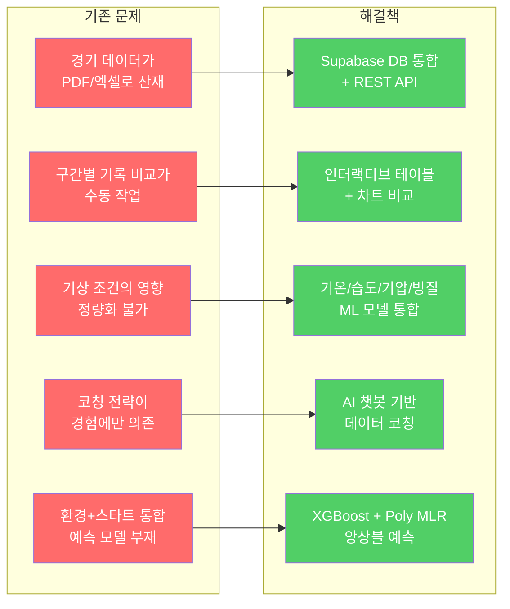
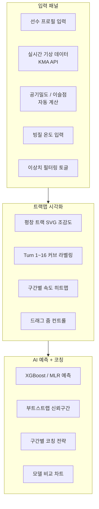
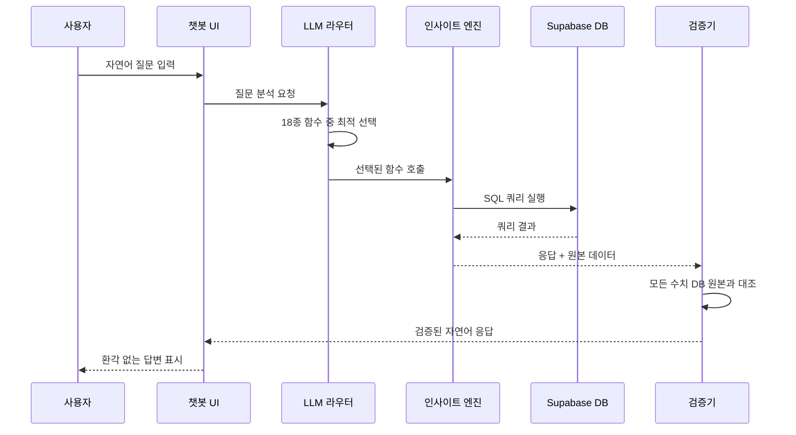
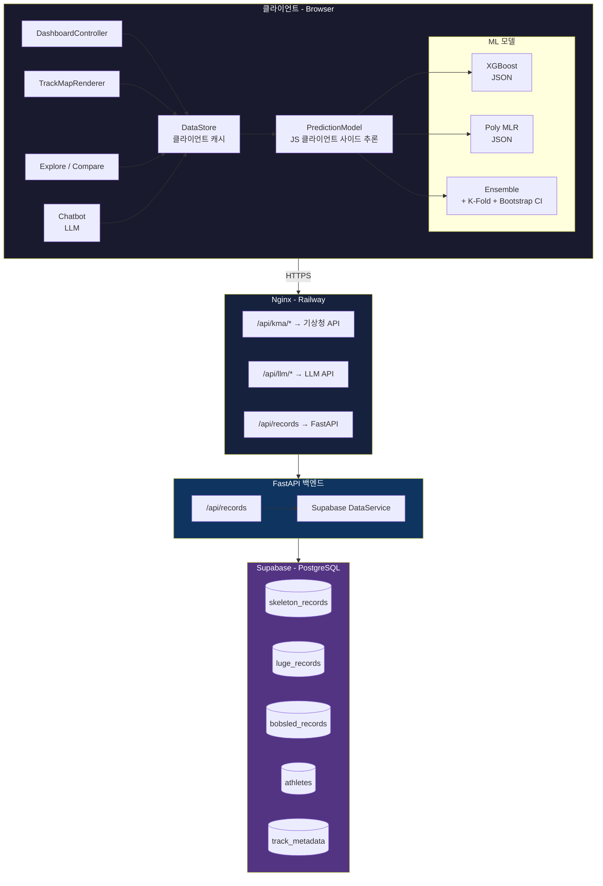
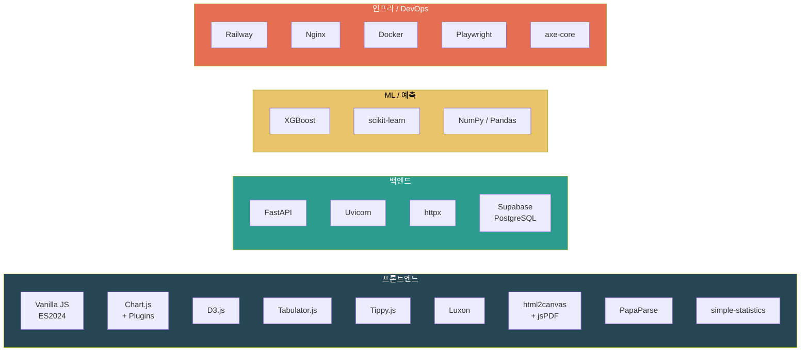
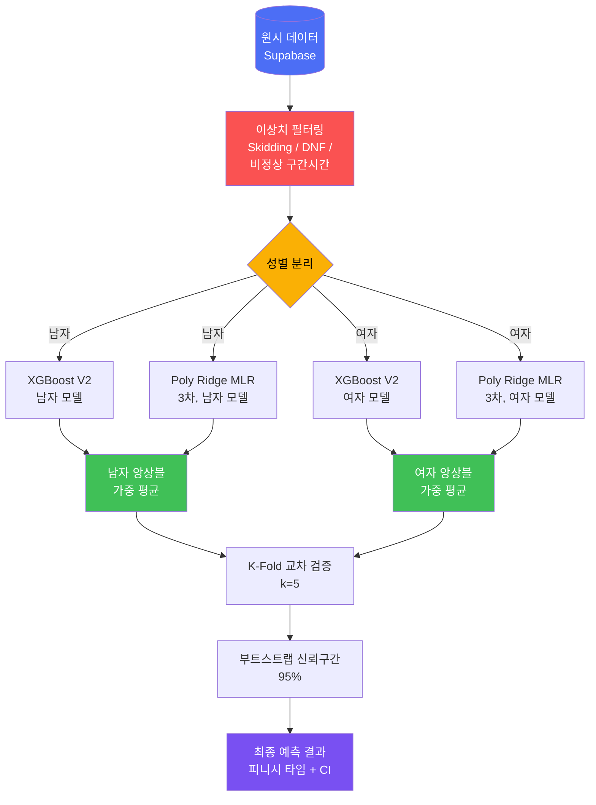
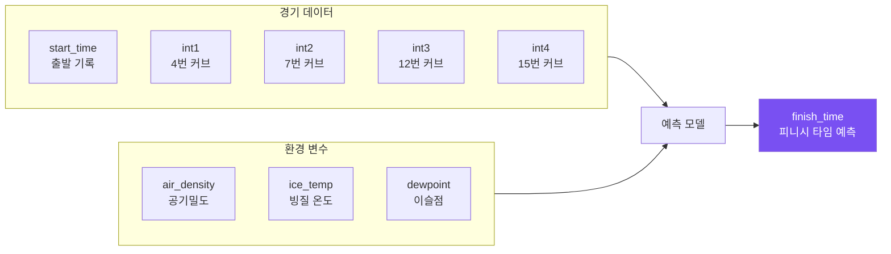
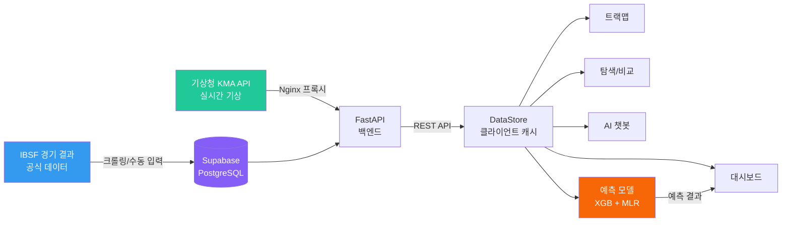
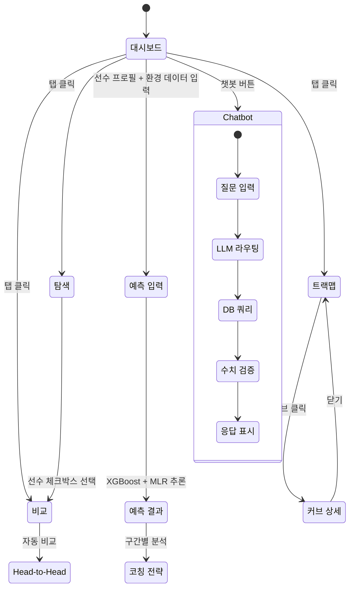

<div align="center">

# 스켈레톤 경기 분석 플랫폼

### AI 기반 경기 기록 분석 & 피니시 타임 예측 시스템

[](https://skeleton-analysis-production-d1bb.up.railway.app/)
[](https://python.org)
[](https://fastapi.tiangolo.com)
[](https://developer.mozilla.org)
[](https://supabase.com)
[](https://xgboost.readthedocs.io)

<br/>

**스켈레톤 / 루지 / 봅슬레이** 경기 데이터를 실시간으로 분석하고,<br/>
머신러닝 모델로 피니시 타임을 예측하며, AI 챗봇으로 코칭 인사이트를 제공합니다.

[](https://skeleton-analysis-production-d1bb.up.railway.app/)

[기술 스택](#-기술-스택) | [실행 방법](#-실행-방법)

<br/>


<br/>


</div>

---

## 목차

- [프로젝트 소개](#-프로젝트-소개)
- [Abstract](#-abstract)
- [핵심 기능](#-핵심-기능)
- [시스템 아키텍처](#-시스템-아키텍처)
- [기술 스택](#-기술-스택)
- [예측 모델](#-예측-모델)
- [데이터 흐름](#-데이터-흐름)
- [프로젝트 구조](#-프로젝트-구조)
- [실행 방법](#-실행-방법)
- [팀 소개](#-팀-소개)
- [참고 자료](#-참고-자료)

---

## 프로젝트 소개

> [!IMPORTANT]
> **"스타트 0.1초 단축 = 피니시 약 0.3초 단축"** — 슬라이딩 종목에서 0.01초가 메달을 결정합니다.

평창 알펜시아 슬라이딩센터(1,376m, 커브 16개)에서 열리는 **스켈레톤, 루지, 봅슬레이** 경기의 데이터를 수집, 분석, 예측하는 풀스택 웹 플랫폼입니다.

### 문제 정의 & 해결책



---

## Abstract

This platform provides an end-to-end data analytics and prediction system for **sliding sports** (Skeleton, Luge, Bobsled) at the Pyeongchang Alpensia Sliding Centre.

It integrates **real-time weather data** (temperature, humidity, barometric pressure, ice temperature) with **race split times** to predict finish times using an ensemble of **XGBoost** and **Polynomial Ridge Regression** models. The system achieves cross-validated R2 > 0.95 for skeleton predictions.

An **AI chatbot** powered by LLM function routing enables natural language queries against the race database with a zero-hallucination pipeline that verifies every number against actual data.

---

## 핵심 기능

### 1. 대시보드 — 3단 분석 인터페이스



### 2. 트랙맵 분석

> [!NOTE]
> 평창 알펜시아 슬라이딩센터의 실제 트랙 구조를 SVG로 재현하여, 각 커브별 데이터를 시각적으로 분석합니다.

<div align="center">

</div>


- **SVG 기반** 평창 트랙 지형도 렌더링
- 커브별 진입속도, 온도, 시간 데이터 오버레이
- **컬러 그라데이션** 속도 범례 (60~140 km/h)
- 특정 커브 클릭 시 상세 분석 패널 표시

### 3. 탐색 & 비교

- **다중 필터링**: 선수명, 국적, 날짜, 성별, 세션
- **Tabulator.js** 기반 정렬 가능한 데이터 테이블
- **체크박스 선택** 후 선수 간 구간 기록 병렬 비교
- **Head-to-Head** 자동 비교 분석

### 4. AI 챗봇 — 제로 환각 파이프라인

> [!TIP]
> 자연어로 질문하면 DB에서 직접 데이터를 조회하고, 모든 수치를 원본과 대조 검증한 뒤 응답합니다.
> 예: *"윤성빈 선수의 최고 기록은?"*, *"3월 평균 피니시 타임 비교해줘"*



- **LLM 기반 함수 라우팅** (18종 인사이트 함수)
- 한국어 조사 제거 (와/과/이랑/은/는) + DB 기반 한국어 이름 해석
- **모든 수치를 DB 원본과 대조 검증** — 환각(hallucination) 방지
- 월별 트렌드, 최고/최저 기록, 선수 비교 등 자연어 질의 지원

### 5. 멀티 스포츠 지원

| 종목 | 데이터 | 예측 모델 |
|------|--------|-----------|
| 스켈레톤 | 전체 지원 | XGBoost V2 + Poly MLR |
| 루지 | 데이터 분석 | XGBoost V1 |
| 봅슬레이 | 데이터 분석 | XGBoost V1 |

---

## 시스템 아키텍처



> [!NOTE]
> 예측 모델(XGBoost, Poly MLR)은 **클라이언트 사이드**에서 JSON으로 로드되어 추론됩니다. 서버 왕복 없이 즉시 예측 결과를 제공합니다.

---

## 기술 스택



| 분류 | 기술 | 용도 |
|------|------|------|
| **프론트엔드** | Vanilla JavaScript (ES2024) | SPA 아키텍처, 모듈 기반 |
| | Chart.js + Plugins | 속도/시간 차트, 줌, 어노테이션, 데이터라벨 |
| | D3.js | SVG 트랙맵 렌더링 |
| | Tabulator.js | 인터랙티브 데이터 테이블 |
| | Tippy.js | 툴팁 UI |
| | Luxon | 날짜/시간 처리 |
| | html2canvas + jsPDF | 대시보드 PDF 내보내기 |
| | PapaParse | CSV 파싱 |
| | simple-statistics | 클라이언트 사이드 통계 연산 |
| **백엔드** | FastAPI | REST API 서버 |
| | Uvicorn | ASGI 서버 |
| | httpx | Supabase 비동기 HTTP 통신 |
| | Supabase (PostgreSQL) | 경기 기록 DB + 선수 DB |
| **ML / 예측** | XGBoost | 피니시 타임 예측 (메인 모델) |
| | scikit-learn | Polynomial Ridge Regression, Cross-Validation |
| | NumPy / Pandas | 데이터 전처리 |
| **인프라** | Railway | 배포 플랫폼 (Nixpacks) |
| | Nginx | 정적 파일 서빙 + API 프록시 (CORS 우회) |
| | Docker | 컨테이너화 |
| | Playwright | E2E 테스트 |
| | axe-core | 접근성 테스트 |

---

## 예측 모델

> [!IMPORTANT]
> 선행연구에서 **환경 변수(기온, 습도, 기압, 빙질)와 스타트 기록을 통합한 다변량 예측 모델**은 거의 없었습니다.
> 본 프로젝트는 이 공백을 XGBoost + Polynomial MLR 앙상블로 채웁니다.

<div align="center">

</div>


### 모델 파이프라인



### 특성 변수 (Features)



### 핵심 도메인 지식

> [!TIP]
> 스타트 구간은 선수의 **스프린트 능력**이 직접 반영되는 유일한 구간입니다.
> 이후 구간은 중력 + 트랙 형상 + 주행 라인에 의해 결정되므로, 스타트 기록이 전체 성적에 3배로 증폭됩니다.

| 법칙 | 수치 |
|------|------|
| 스타트 0.1초 단축 시 피니시 단축 | **약 0.3초** (3배 증폭 효과) |
| 정상 스타트 범위 (남자) | 4.7 ~ 5.5초 |
| 정상 피니시 범위 | 50 ~ 55초 |
| 환경 변수 | 공기밀도, 빙질 온도, 이슬점 |

### 검증 성능

| 모델 | R2 (CV) | MAE | 비고 |
|------|---------|-----|------|
| XGBoost V2 | > 0.95 | < 0.15초 | 스켈레톤 메인 |
| Poly MLR (3차) | > 0.93 | < 0.20초 | 해석 가능 모델 |
| 앙상블 | > 0.96 | < 0.13초 | 최종 예측 |

---

## 데이터 흐름

### 경기 데이터 수집 ~ 시각화 전체 흐름



### 사용자 인터랙션 흐름



---

## 프로젝트 구조

```
skeleton-analysis/
+-- backend/                    # FastAPI 서버
|   +-- main.py                 # API 엔드포인트 + 정적 파일 서빙
|   +-- models.py               # Pydantic 데이터 모델
|   +-- data_service.py         # Supabase 데이터 로더 (비동기)
|   +-- config.py               # 환경 설정
|   +-- requirements.txt        # Python 의존성
|
+-- web/
|   +-- src/
|   |   +-- index.html          # SPA 엔트리포인트
|   |   +-- js/
|   |   |   +-- DashboardController.js  # 대시보드 탭 로직
|   |   |   +-- DataStore.js            # 클라이언트 데이터 캐시
|   |   |   +-- PredictionModel.js      # ML 추론 엔진 (1,121줄)
|   |   |   +-- TrackMapRenderer.js     # SVG 트랙맵 렌더링
|   |   |   +-- ChartManager.js         # Chart.js 래퍼
|   |   |   +-- Chatbot.js              # AI 챗봇 (LLM + 인사이트)
|   |   |   +-- TableRenderer.js        # Tabulator 래퍼
|   |   |   +-- PlayerAnalyzer.js       # 선수 분석 로직
|   |   |   +-- UIController.js         # UI 상태 관리
|   |   |   +-- xgb-models.js           # XGBoost JSON 모델
|   |   |   +-- poly-mlr.js             # Polynomial MLR 계수
|   |   |   +-- trackmap-data.js        # 트랙 메타데이터
|   |   +-- css/
|   |       +-- main.css                # 메인 스타일
|   |       +-- dashboard.css           # 대시보드 레이아웃
|   +-- dist/                   # 빌드 산출물
|   +-- bundle.js               # 번들러
|
+-- nixpacks.toml               # Railway 배포 설정
```

---

## 실행 방법

### 사전 요구사항

> [!WARNING]
> Python **3.12 이상**이 필요합니다. 3.11 이하에서는 `|` 타입 힌트 문법으로 인해 서버가 시작되지 않습니다.

- Python 3.12+
- Node.js (테스트 실행 시)

### 로컬 개발

```bash
# 1. 저장소 클론
git clone https://github.com/Technoetic/skeleton-analysis.git
cd skeleton-analysis

# 2. Python 의존성 설치
pip install -r backend/requirements.txt

# 3. FastAPI 서버 실행
python -m uvicorn backend.main:app --host 127.0.0.1 --port 3000

# 4. 브라우저에서 접속
open http://localhost:3000
```

### Docker 실행

```bash
docker build -t skeleton-analysis .
docker run -p 8080:80 skeleton-analysis
```

### Railway 배포

> [!NOTE]
> `nixpacks.toml`이 자동으로 Python 3.12 환경을 구성하고 Uvicorn 서버를 시작합니다. 별도 설정 없이 `railway up`만 실행하면 됩니다.

```bash
railway up
```

### 배포 흐름


---

## 팀 소개

<table>
<tr align="center">
<td>
<a href="https://github.com/Technoetic">

<br/><b>Technoetic</b>
</a>
<br/>풀스택 / ML / 디자인
</td>
</tr>
<tr align="center">
<td>
<a href="https://github.com/junhyeonkim92-oscar">

<br/><b>junhyeonkim92-oscar</b>
</a>
<br/>팀원
</td>
</tr>
</table>

---

## 참고 자료

<details>
<summary><b>선행연구 & 논문</b></summary>

| 저자 | 연도 | 제목 | 핵심 기여 |
|------|------|------|-----------|
| Vracas et al. | 2023 | Altenberg 트랙 시뮬레이션 | 1D 운동방정식, 민감도 분석 |
| Poirier | 2011 | F.A.S.T. 3.2b 마찰 모델 | 러너-얼음 마찰 비선형 모델 |
| Colyer et al. | 2017 | 엘리트 스켈레톤 스타트 성능 | 스타트 예측 R2=0.86 |

</details>

---

<div align="center">


<br/>

**슬라이딩 스포츠 커뮤니티를 위해 제작되었습니다**

[](https://railway.app)

</div>
